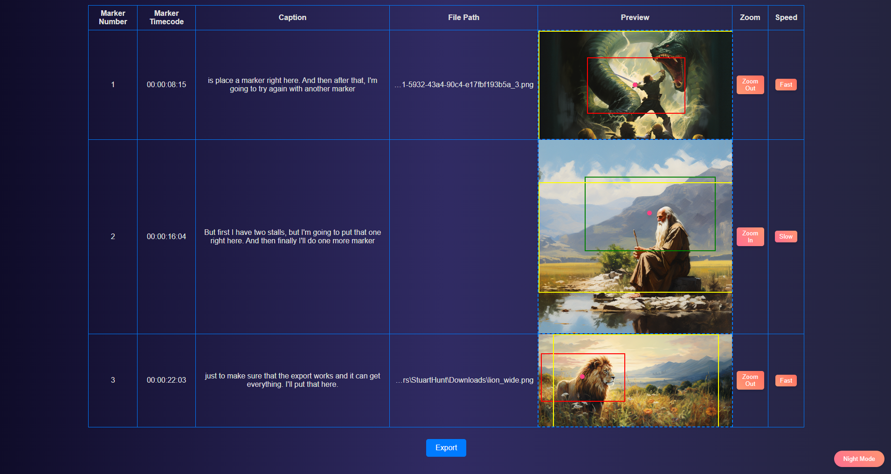
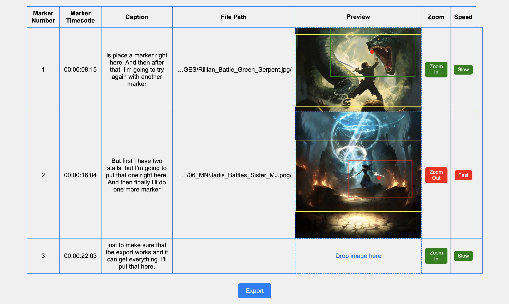

# DropMotion



## Features

- Drag and drop images directly into the table.
- Automatically position and scale images based on predefined parameters.
- Apply motion effects such as zoom and speed adjustments.
- Center dot for positioning, draggable to adjust placement.
- Easy export to JSON format for integration with Premiere Pro.

## Prerequisites

- Adobe Premiere Pro
- Node.js
- Electron  

## How It Works

1. **Export Marker List and Transcript from Premiere Pro**:
    - Export a marker list from your Premiere Pro project.
    - Export the transcript associated with the timeline.

2. **Import Data into DragAndDrop**:
    - Load the marker list and transcript into DropMotion.

3. **Drag and Drop Images**:
    - Drag and drop images into the table at the corresponding markers.

4. **Adjust Image Properties**:
    - Use the provided controls to adjust zoom and speed effects.
    - Drag the central dot to fine-tune the image position.

5. **Export to FinalCut XML**:
    - Export the configured data to an FinalCut XML file for easy integration back into Premiere Pro.

## Getting Started

1. **Clone the Repository**:
    ```bash
    git clone https://github.com/StuartHunt99/DropMotion.git
    cd DropMotion
    ```

2. **Install Dependencies**:
    ```bash
    npm install
    ```

3. **Run the Application**:
    ```bash
    npm start
    ```

4. **Make Cool Stuff!**